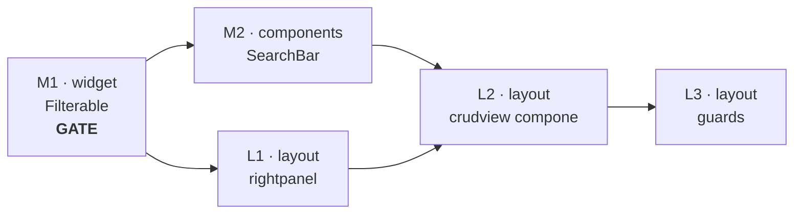

# Refactor arquitectónico de `layout` — opinión y camino definitivo

> Documento de decisión, en español por pedido explícito. Evalúa `crudview` y
> `rightpanel` contra
> [CONSTRUCTION_HARNESS.md](https://github.com/tinywasm/app-releases/blob/main/docs/CONSTRUCTION_HARNESS.md),
> que es la autoridad del ecosistema.

---

## Veredicto en tres líneas

1. **No hace falta un repositorio nuevo.** El hueco no es una caja que falta; es
   un **contrato** que falta, y el archivo donde va ya existe:
   `widget/capability.go`.
2. **Sí hay deuda técnica hoy**, y es una sola: `crudview` y `rightpanel` son dos
   implementaciones del mismo esqueleto. Eso viola el principio 4 del harness
   ("una sola forma de hacer cada cosa") y la regla lego 9.
3. **Mi plan anterior era parte del problema**, no de la solución. Lo explico
   abajo sin adornos, porque es la mejor evidencia disponible de tu preocupación.

---

## 1. Qué está mal, regla por regla

### 1.1 Dos esqueletos para el mismo trabajo

`rightpanel` (2026-04-15, 133 líneas, cero lógica) y `crudview` (2026-07-08,
500 líneas Go + 240 CSS) declaran la misma anatomía con distinto nombre:

| Concepto | `rightpanel` | `crudview` |
|---|---|---|
| Grilla dos columnas | `main`: `Split(SplitTwoThirds, Space2), Fill()` | `Root`: `Split(SplitTwoThirds, Space2), Fill()` |
| Contenido principal | `article` | `article` / `fields` |
| Columna lateral | `aside` | `aside` |
| Contenido lateral | `aside-content` | `aside-content` / `list` |
| Controles del lateral | **`AsideControls`** — *"e.g. search + filter"* | `search` ← **hardcodeado** |

`rightpanel.AsideControls` es literalmente el slot que hacía falta, documentado
con esa frase, tres meses antes de que `crudview` lo hardcodeara.

El harness lo nombra sin ambigüedad:

> *"A consumer never re-creates a missing symbol locally… Recreating it
> downstream forks that library's responsibility, and the copy can never be
> reused."*
> *"Never wrap a library to fix its behaviour. A wrapper that patches a defect is
> a fork with a friendlier name."*

`crudview` no envolvió a `rightpanel`: lo recreó. Es el mismo defecto con peor
trazabilidad, porque no queda ni un import que delate el parentesco.

**Evidencia de que no fue deliberado:** [`ARCHITECTURE.md`](ARCHITECTURE.md) →
"Package Layout" todavía lista solo `platformd` y `rightpanel`. `crudview` nunca
se agregó al mapa. El documento registra la estructura que se pensó; el código
registra la que se acumuló.

### 1.2 El contrato de operaciones sí se resolvió bien

Conviene decirlo porque es el contraejemplo que prueba que el método funciona:
`view.Presenter` (`Title/Filter/Reload/Select/Deselect`) más `view.Saver` y
`view.Deleter` como capacidades descubiertas por type-assert **es exactamente el
patrón lego del harness** — "capability bag + type assertion at the seam". Vive
en su propio repo, es agnóstico de DOM y tiene suite de conformance.

Esa separación ya está lograda. No se toca.

### 1.3 Falta un contrato en la costura del filtro

Cuando un control de filtro (barra, calendario, select) tiene que hablarle a
`Presenter.Filter(term string)`, **no existe ningún tipo que nombre lo que cruza
esa costura**. El harness tiene una entrada de checklist para esto:

> *"Missing contracts at the seams. A boundary where a consumer would have to
> declare a local interface to name what crosses it → name it here instead."*

Y el ecosistema **ya tiene el archivo donde va**:

```go
// widget/capability.go — tal como está hoy
type Selectable  interface{ Select(id string) }
type Dismissible interface{ Dismiss() }
type Expandable  interface{ Expand(open bool) }
```

Falta la cuarta línea. Precedente idéntico, escrito por ti, en
[`widget/field.go`](https://github.com/tinywasm/widget/blob/main/field.go):

> *"It lives here because it crosses the boundary between these two libraries,
> and neither can own it without the other depending on it."*

`widget` es la casa de los contratos que cruzan librerías de UI. No hay que
inventar nada.

---

## 2. Mi plan anterior es la evidencia de tu miedo

Dijiste: *"si sigo pidiéndole a un LLM como tú que haga cosas, duplicará lógica
como pasó con rightpanel y crudview"*. Tienes razón, y ya pasó en este hilo.

Cuando me pediste hacer `crudview` reutilizable, produje
[`PLAN.md`](PLAN.md) que:

- **declaró `FilterSource` local dentro de `crudview`** — la interfaz local que
  el checklist del harness prohíbe explícitamente;
- **amplió la superficie** de `crudview` con un slot nuevo (viola el principio 5,
  "minimal surface") en lugar de reducirla;
- **no mencionó `rightpanel` ni una vez**, aunque el slot que yo inventaba ya
  existía ahí;
- **revirtió en silencio una decisión registrada** en
  [`ROADMAP.md`](ROADMAP.md) (*"search: plain `<input type=search>` inside
  crudview (explicit decision)"*).

Es exactamente el modo de fallo que el harness predice, palabra por palabra:

> *"An API gap always surfaces at the **leaf** (the application), where the agent
> has no authority to publish upstream — so it patches locally. **Technical debt
> is then not an accident: the workflow guarantees it.**"*

Yo estaba en la hoja (`crudview`), el hueco estaba arriba (`widget`), y parcheé
donde estaba parado. La conclusión importante: **esto no se arregla pidiéndome
más cuidado.** Se arregla con estructura — sección 5.

---

## 3. ¿Repositorio nuevo? No

Lo evalué en serio y la respuesta es no, por tres razones:

1. **El hueco es un tipo, no un paquete.** Un repo nuevo agregaría un eje de
   versionado y una superficie de version-skew para resolver algo que se
   resuelve con una interfaz de una línea en un archivo que ya existe.
2. **"Lego pieces" no significa "un repo por tipo".** La regla es *un concern,
   un contrato tipado*. `layout` tiene un concern legítimo: el chasis de módulo.
   Que hoy lo implemente dos veces es un bug de ese repo, no una señal de que
   sobren concerns.
3. **Las dependencias ya están todas en el grafo de `layout`** (`form`, `dom`,
   `components/targetlist`, `view`). Mover el controlador afuera no elimina un
   solo import; solo agrega un release más que sincronizar.

**Regla que sí aplica:** el repo nuevo se justifica cuando dos librerías
necesitan un tipo y ninguna puede poseerlo sin que la otra dependa de ella. Ese
caso aquí se resuelve con `widget`, que es precisamente la librería que ya
cumple ese rol.

---

## 4. El camino definitivo

Cuatro movimientos, en orden de dependencia. Cada uno **reduce** superficie.

### M1 — `widget`: nombrar el contrato de filtrado

```go
// widget/capability.go
// Filterable lo implementa un control que produce un término de búsqueda:
// una barra de texto, un calendario que formatea su rango, un select que emite
// un id. El anfitrión lo descubre por type-assert y decide qué significa el
// término.
type Filterable interface{ OnFilterChange(func(term string)) }
```

Una línea. Sin imports. Es lo único que hace que la pieza sea intercambiable sin
que nadie declare una interfaz local.

### M2 — `components`: `SearchBar`

Extraer la barra de `crudview` a `components/searchbar`, implementando
`widget.Filterable`. El plan ya existe y solo cambia en ese punto (usar el tipo
de `widget` en vez de definir el suyo).

### M3 — `layout`: **un solo esqueleto**

Este es el movimiento que paga, y el que mi plan anterior no contemplaba.

```
ANTES                                  DESPUÉS
rightpanel  ── esqueleto puro          rightpanel ── el único esqueleto
crudview    ── esqueleto + controlador               (+ master-detail móvil)
               ↑ duplicado             crudview   ── solo controlador
                                                     rellena slots de rightpanel
```

- `rightpanel` **absorbe** el master-detail móvil de `crudview` (`MasterDetail`,
  scroll-snap, el fix de dirección `rtl`). Se **mueve**, no se reinventa: hoy es
  la única capacidad que `crudview` tiene y `rightpanel` no, y es lo que impide
  la fusión.
- `crudview` deja de emitir grilla. Rellena: `Article`←form,
  `AsideControls`←filtro, `Aside`←targetlist + botón toggle.
- El slot de filtro **ya no se inventa**: es `AsideControls`, y `rightpanel` hace
  el type-assert a `widget.Filterable`.

`crudview/css.go` pierde ~60% de sus reglas. Su API **no crece**: `Config` gana
`Filter`, y `SearchPlaceholder` sigue viva alimentando el default.

### M4 — lo que `crudview` conserva, y por qué

Después de M3, `crudview` es un **controlador** y nada más:

- la máquina de estados `selected` / `composing` / `active()` — semántica del
  toggle `+` ↔ `↺`;
- la orquestación: select→load+lock, edit→unlock+focus, save→sync+persist+reload,
  delete→confirm→reload;
- el cumplimiento de `view/conformance`.

**Por qué eso sí le pertenece:** es la respuesta directa a *"the glue is written
once, in the library that owns it"*. Sin esta pieza, cada aplicación reescribe
el mismo cableado form↔lista↔transporte. Es lógica crítica, no opinión visual, y
ya tiene su prueba consumer-shaped — que es el requisito de publicación del
harness:

> *"if a CRUD layout is meant to take a model, generate a form from it, and ship
> it through a caller, then the library must contain a test that does exactly
> that — with a real model, the real form package, and a fake caller."*

[`crudview/consumer_test.go`](../crudview/consumer_test.go) es exactamente eso.
Esa parte ya está bien y no se toca.

---

## 5. Cómo se impide la reincidencia

Esta es la sección que más importa, y no es "documentar mejor". El harness ya
dice que los documentos largos son síntoma, no cura:

> *"long 'skill' documents full of context are unnecessary. If the API is a
> harness, a minimal cheat-sheet is enough."*

La duplicación se previene con **tests que fallan cuando aparece**, igual que
[`components/conformance_test.go`](https://github.com/tinywasm/components/blob/main/conformance_test.go)
ya parsea el AST de cada `css.go` para rechazar `css.Raw` y colores literales.
El precedente existe; solo hay que apuntarlo a esto:

1. **Un solo dueño de la grilla.** Test que parsea los `css.go` de `layout` y
   falla si `Split`, `MasterDetail` o `Grid` aparecen en más de un paquete.
   Es el test que habría hecho imposible este problema en julio.
2. **Prohibido nombrar localmente lo que cruza.** Test que falla si un paquete de
   `layout` declara una interfaz cuyo único método lo implementa un tipo de otro
   repo — la firma del parche-en-la-hoja.
3. **Contrato compartido para las costuras nuevas.** Cualquier slot futuro
   (calendario, select, rango de fechas) declara su capacidad en
   `widget/capability.go`. Como es una línea y ya hay tres vecinas, es más barato
   hacerlo bien que mal — que es la definición de harness.

Y una regla de proceso, la única que agrego: **un plan que amplía la superficie
pública de una pieza tiene que justificar por qué no la reduce.** Mi plan
anterior no habría pasado ese filtro.

---

## 6. Estado de los planes

Todos escritos. Se ejecutan **en local, uno por despacho**, verificando `gotest`
verde antes del siguiente.

| # | Repo | Plan | Qué |
|---|---|---|---|
| **M1** | `widget` | `widget/docs/PLAN.md` | **Gate.** `Filterable` en `capability.go` + test |
| M2 | `components` | `components/docs/PLAN.md` | `SearchBar` implementa `widget.Filterable` |
| L1 | `layout` | [PLAN_STAGE_1_RIGHTPANEL.md](PLAN_STAGE_1_RIGHTPANEL.md) | `rightpanel` pasa a ser el único esqueleto |
| L2 | `layout` | [PLAN_STAGE_2_CRUDVIEW.md](PLAN_STAGE_2_CRUDVIEW.md) | `crudview` lo compone y suelta la grilla |
| L3 | `layout` | [PLAN_STAGE_3_GUARDS.md](PLAN_STAGE_3_GUARDS.md) | tests anti-duplicación |

Índice y reglas comunes: [PLAN.md](PLAN.md).
Orquestador multi-repo: `app-releases/docs/LAYOUT_UNIFICATION_MASTER_PLAN.md`.



M1 es **gate**: sin él, M2 y L2 vuelven a declarar interfaces locales.

El orden recomendado (`M1 → M2 → L1 → L2 → L3`) deja el demo funcionando después
de **cada** despacho. El único que puede mover `#crud` es L2, y ese plan lleva
una medición obligatoria antes/después.

### Hallazgo que apareció al verificar

`rightpanel` **está roto hoy**: su `Split` está en `rp__main` (hijos: header y
article) y el `Stack` en la raíz (hijos: main y aside) — invertido. Medido en el
demo vivo en `#mod1`:

```
rp__header  top=42 left=764  w=498   ← el título
rp__article top=42 left=1270 w=256   ← el contenido, en columna al lado
```

No se nota porque ningún módulo del demo pasa `Aside`. L1 lo arregla. Esto no
cambia el diagnóstico; lo refuerza: la duplicación escondió un defecto durante
tres meses en el paquete que *nadie* estaba mirando.

---

## 7. Lo que NO se hace

- **Repositorio nuevo.** Sección 3.
- **Tocar `view`.** El contrato de operaciones está correcto. `SearchPlaceholder()`
  sigue viva y alimenta el default del filtro.
- **Construir el calendario o el select.** M1–M3 solo abren la costura. Cada
  control es su propio componente, después.
- **Borrar `rightpanel` ni `crudview`.** La fusión los conserva a ambos con roles
  disjuntos: esqueleto y controlador.
- **Rehacer el CSS que hoy se ve bien.** La captura del demo es la línea base;
  M3 mueve reglas entre archivos sin cambiar un valor. Cualquier diferencia
  visual después de M3 es un bug de M3, no una mejora.
