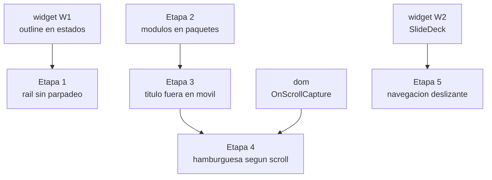

> Este plan se despacha con el flujo CodeJob. Ver skill: agents-workflow.

# Plan maestro — `tinywasm/layout`

Cinco defectos observados sobre el demo en funcionamiento (`platformd/web/client.go`).
Cada uno es una **etapa independiente** con su propio archivo: se ejecutan y se
revisan de una en una, respetando el orden que impone el grafo de abajo.

---

## Índice de etapas

| # | Etapa | Qué arregla | Depende de |
|---|---|---|---|
| 1 | [Rail sin parpadeo](PLAN_STAGE_1_HOVER_RAIL.md) | En escritorio, el hover del menú hace crecer el ítem 2px y todo el rail parpadea | `widget` W1 |
| 2 | [Módulos en paquetes](PLAN_STAGE_2_MODULES.md) | `client.go` mezcla el modelo, el CRUD y el cableado; los módulos no se pueden multiplicar | — |
| 3 | [Título fuera en móvil](PLAN_STAGE_3_MOBILE_TITLE.md) | El título flota sobre el contenido; el hamburguesa muestra un icono fijo en vez de dónde estás | Etapa 2 |
| 4 | [Hamburguesa según el scroll](PLAN_STAGE_4_HAMBURGER_SCROLL.md) | El botón de menú tapa el contenido de forma permanente en móvil | `dom` + Etapa 3 |
| 5 | [Navegación deslizante](PLAN_STAGE_5_SECTION_SLIDE.md) | Deslizar dentro de un artículo salta de sección sola | `widget` W2 |

## Planes aguas arriba (otros repositorios)

Dos etapas necesitan un cambio en una librería de la que este repositorio depende.
Cada uno tiene su propio plan, y **hay que publicarlos antes** de ejecutar la etapa
que los consume:

- **`tinywasm/widget`** → <https://github.com/tinywasm/widget/blob/main/docs/PLAN.md>
  - W1: las reglas de estado emiten `outline` en vez de `border` → habilita la Etapa 1.
  - W2: `SlideDeck` reemplaza a `Deck` → habilita la Etapa 5.
- **`tinywasm/dom`** → <https://github.com/tinywasm/dom/blob/main/docs/PLAN.md>
  - `OnScrollCapture` → habilita la Etapa 4.

## Grafo de dependencias



Etapas 1, 2 y 5 son **paralelas entre sí**. La 3 espera a la 2, y la 4 espera a la 3.

---

## Contexto del repositorio

`tinywasm/layout` provee esqueletos de interfaz. Tres paquetes importan aquí:

| Paquete | Rol |
|---|---|
| `platformd` | El **chasis**: cabecera, rail de navegación, cajón móvil, escenario de módulos, notificaciones. |
| `rightpanel` | Esqueleto de **módulo** a dos columnas (artículo + aside). En móvil se convierte en tira horizontal. |
| `crudview` | Controlador CRUD que se monta dentro de un `rightpanel`. |

El demo vive en `platformd/web/client.go` (`//go:build wasm`, `package main`) y es
lo que se ve en el navegador durante el desarrollo.

### Hot reload — NO compilar a mano

El servidor de desarrollo de TinyWasm recompila y re-sirve en cada cambio de
fuente (Go, `css.go`, assets SSR). **No** ejecutes `go build`, ni
`GOOS=js GOARCH=wasm go build`, ni reinicies el servidor "para que tome el
cambio", ni hagas polling sobre el endpoint wasm. Edita el archivo y mira la
aplicación (recarga el navegador / captura pantalla). La única razón para compilar
a mano es una verificación puntual de tipos.

### Cómo verificar visualmente

El demo se inspecciona con las herramientas de navegador del MCP de TinyWasm:
`browser_navigate`, `browser_screenshot`, `browser_emulate_device` (`mobile` /
`desktop`), `browser_evaluate_js`, `browser_get_styles`. Cada etapa termina con una
comprobación concreta sobre el demo corriendo; están escritas en cada archivo.

---

## Reglas del ecosistema — se violan si no están escritas

Válidas para **todas** las etapas.

### WASM / TinyGo

- **Sin stdlib** en código que se compila a WASM: nada de `errors`, `strconv`,
  `strings`, `fmt`, `encoding/json`. Se usa `github.com/tinywasm/fmt`,
  `github.com/tinywasm/json`, `github.com/tinywasm/time`.
- **Sin `map`** en ningún archivo que llegue a WASM: inflan el binario TinyGo. Un
  barrido sobre `[]fmt.KeyValue` o un `switch` los sustituye.
- **Sin genéricos**, sin `defer`/`recover`.
- El DOM solo por `github.com/tinywasm/dom`, **nunca** `syscall/js` directo.
- **`dom.Element` se embebe por VALOR**, jamás como `*dom.Element`: el puntero
  duplica la reserva en heap y presiona el GC de TinyGo.

> **Anti-footgun:** los archivos `//go:build !wasm` (`css.go`, `svg.go`) **sí**
> pueden usar stdlib y maps — son backend puro y no llegan al navegador. No los
> "arregles".

### Contrato de componente — una sola forma

Los componentes implementan **solo** `Render() *dom.Element` (+ `Init(ctx dom.Ctx)`
opcional). **No existe** `OnMount`/`OnUpdate`/`OnUnmount` ni un `Update()` manual.

- La configuración de una sola vez (listener de hash, ruta inicial, listener de
  scroll) va en `Init(ctx)`. El framework lo ejecuta **una vez**: no escribas un
  guardián `mounted bool`.
- El estado que la UI muestra vive en señales tipadas: `*SignalString`,
  `*SignalBool`, `*SignalNodes`. Nunca `Signal[T]`.
- Los manejadores de eventos **solo** mutan señales; el DOM enlazado se parchea
  quirúrgicamente. Jamás se re-renderiza el árbol entero.
- Teardown de recursos asíncronos: `ctx.OnCleanup(fn)`.

### Separación por extensión (SSR)

CSS, SVG, JS y HTML pesado viven en archivos con nombre de extensión y build tag
`//go:build !wasm`: `css.go` (`RenderCSS`/`RootCSS`), `svg.go` (`IconSvg`),
`js.go` (`RenderJS`), `html.go` (`RenderHTML`). Nunca en un `ssr.go`.

`tinywasm/ssr` los localiza por **nombre exacto de función**. Dos reglas que rompen
en silencio si se ignoran:

1. **Nombre exacto.** `RenderCSS`, no `GenerateCSS` ni `Styles`. Un nombre distinto
   no se emite jamás y el componente sale sin estilos, sin fallar la compilación.
2. **Un solo receptor por paquete.** Todos los productores de un paquete deben ser
   métodos del **mismo** tipo (o todos funciones libres). Mezclar
   `func (m *Module) IconSvg()` con `func RenderCSS()` genera código que llama a un
   método inexistente.

Además, `ssr` instancia el receptor como **valor cero** (`inst := &pkg.Tipo{}`), así
que `IconSvg()` debe funcionar sobre un struct vacío.

### Iconos SVG — el nombre se comparte, el dibujo es backend

1. **Declarar** la referencia en un archivo **sin build tag**: `svg.Icon("nombre")`.
2. **Definir** el dibujo en `svg.go` con `//go:build !wasm`:
   `sprite.Define(icono, "viewBox", sprite.Path("d…"))`.
3. **Renderizar** con `icono.Render("clase")`. Es la **única** ruta soportada — no
   construyas `<svg><use href="#id"/></svg>` a mano.

`svg/sprite` compila también para WASM, así que olvidar el `//go:build !wasm` **no
rompe el build**: mete todas las cadenas `d` en el bundle del navegador en
silencio. Solo lo caza el grafo de dependencias:

```bash
GOOS=js GOARCH=wasm go list -deps ./platformd | grep tinywasm/svg/sprite   # DEBE estar vacío
GOOS=js GOARCH=wasm go list -deps ./crudview  | grep tinywasm/svg/sprite   # DEBE estar vacío
```

### Textos traducibles

El texto de cromo que escribe la librería (títulos de diálogo, etiquetas de botón,
`aria-label`) pasa por `lang.Translate(...)` de `github.com/tinywasm/fmt/lang`, con
**una palabra por argumento**. El inglés es la clave canónica. El diccionario es
del consumidor, nunca de la librería. Una palabra idéntica en todos los idiomas
("Menu") se queda como cadena plana. Los literales que da la aplicación
(`CrudView.Title`, `view.WithTitle(...)`) son entrada parametrizada: no se tocan.

### Superficie pública mínima

Se exporta solo la API que el autor de una aplicación usa. Los helpers internos y
los campos de struct se quedan sin exportar.

### Testing

```bash
go install github.com/tinywasm/devflow/cmd/gotest@latest
gotest
```

`gotest`, **nunca** `go test`. Aserciones con stdlib pura, sin librerías de assert.
Tests duales WASM/stdlib; DOM real en los tests WASM.

### `replace` de desarrollo

`go.mod` ya apunta a copias locales de `widget`, `components`, `form` y `css`:

```
replace github.com/tinywasm/widget => ../widget
```

`dom` **no** está en la lista. La Etapa 4 necesita añadirlo:

```
replace github.com/tinywasm/dom => ../dom
```

Todos los `replace` se revierten a versiones publicadas cuando el trabajo aterriza.

---

## Documentación al cerrar

Antes de publicar: actualizar `docs/ARCHITECTURE.md` (ciclo de vida de la
plataforma, señales, `Init(ctx)` una vez), actualizar el diagrama de ciclo de vida
si lo hay (`flowchart TD`, sin `subgraph`, `<br/>` para los saltos) y reindexar
`README.md` para que cada archivo de `docs/` quede enlazado.
