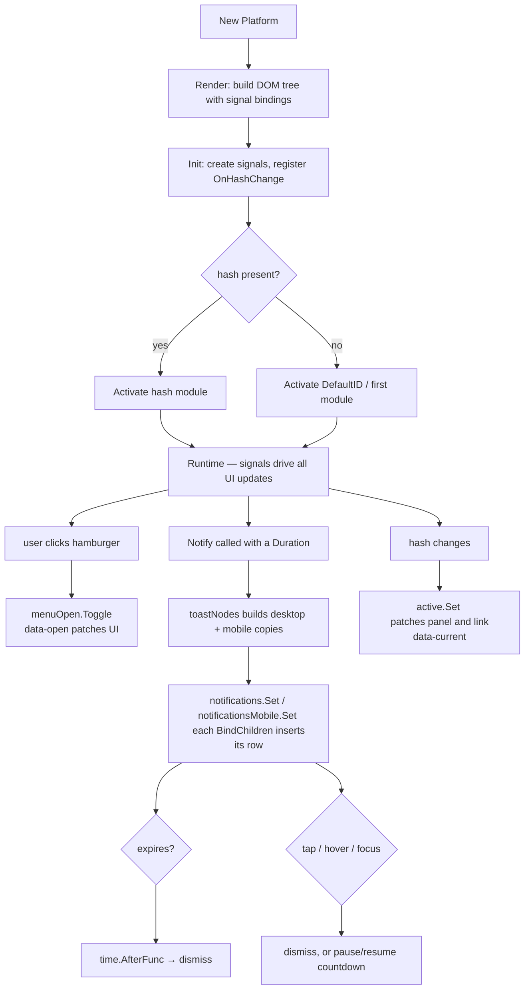

# platformd Architecture

## UIModule Contract

The platform consumes modules via the `UIModule` interface:

```go
type UIModule interface {
    ModelName() string // from layout.Module, used as ID/route
    Label() string     // navigation text
    Icon() svg.Icon    // navigation icon (paints with ClsNavIcon)
    View() Component   // main content
}
```

## Theme Agnostic

`platformd` is theme-agnostic and does not define its own colors. It references semantic tokens from `webtyp.com/css` (`ColorSecondary`, `ColorSurface`, etc.). The actual theme is provided by the root application.

## Routing

- Uses hash-based routing (`#slug`).
- `DefaultID` on `Platform` determines the initial module if no hash is present.
- `Activate(id)` is the single entry point for module switching.

---

## Anatomy

The chassis is built using a structured hierarchy of semantic HTML elements. Each element maps directly to an anatomical part defined in the stylesheet.

### Part Tree

```
root .pd                          Cover  HideOverflow
├── header .pd__header            KeepSize  (mobile: hidden)
│   ├── div  .pd__brand           Row(Space2)  KeepSize
│   ├── div  .pd__msg-slot        Fill  CenterContent  (BindChildren(p.notifications))
│   └── div  .pd__header-right    KeepSize
│       └── user menu component
├── div    .pd__nav-overlay       mobile only, data-open
├── div    .pd__body              Sidebar(SideEnd)  Fill
│   ├── main .pd__stage           Fill  HideOverflow          ← content, first child
│   │   └── section .pd__panel    Scroll  data-current          (one per module)
│   └── nav  .pd__menu            Fill                        ← rail, LAST child
│       └── ul .pd__navbar
│           └── li .pd__nav-item
│               └── a .pd__nav-link  data-current
│                   ├── svg  .pd__nav-icon  IconBox(IconLg)
│                   └── span .pd__link-text
└── div    .pd__msg-stack         mobile only, LAST child (DOM-order tie-break)
    ├── button .pd__hamburger     data-open (stows on scroll)
    └── div  .pd__msg-slot-mobile (BindChildren(p.notificationsMobile))
```

### Where the scroll lives

`Cover()` gives the root a **definite** `height: 100dvh`, not a floor, so the frame
never grows with its content: `HideOverflow()` on the root and on the stage clips,
and the header and rail stay put no matter how tall a module is. The only element
that scrolls is `.pd__panel`, through `Scroll()`. A module that renders its own
scroll region nests it inside that panel.

Every part that renders a bare `<svg>` must declare `IconBox`. An `<svg>` with no
width or height falls back to the replaced-element default of 300×150 and blows the
layout apart — this is what made the rail 150px per item before `IconBox` existed.

### State-Revealed Parts

States are carried by boolean attributes on the DOM, ensuring high efficiency and zero-class toggling logic:
*   **`menu`** (`.pd__menu`) and **`nav-overlay`** (`.pd__nav-overlay`): Revealed by the state `widget.Open` using the attribute `data-open` (driven by the mobile navigation drawer state).
*   **`panel`** (`.pd__panel`) and **`nav-link`** (`.pd__nav-link`): Highlighted or revealed by the state `widget.Current` using the attribute `data-current` (driven by the active route signal).
*   **`hamburger`** (`.pd__hamburger`): Revealed by `widget.Open`, whose binding inverts `navStowed` — the button hides while the page scrolls down.

### Mobile-Only Elements

*   **`msg-stack`** (`.pd__msg-stack`): The toasts' phone home. A fixed wrapper
    Docked top-end, the root's LAST child so it wins the DOM-order tie at
    `--z-dropdown` against the drawer and the overlay. The hamburger rides
    inside it — one anchored box instead of two floating pieces needing an
    offset to stay apart.
*   **`hamburger`** (`.pd__hamburger`): Standard button for triggering the
    navigation drawer. Docked by its `msg-stack` wrapper; `Width(Content)` +
    `PushEnd()` keep it in its corner while the toast block below widens.
*   **`msg-slot-mobile`** (`.pd__msg-slot-mobile`): The mobile toast list.
    `Stack(Space2)` for the inter-toast gap, `Width(Content)` so the stack hugs
    its widest toast and long text wraps inside the box.
*   **`nav-overlay`** (`.pd__nav-overlay`): Dimmed backdrop appearing behind the drawer navigation panel on mobile viewports.

---

## Notifications

`Notify(t, msg, d Duration)` renders the same toast into BOTH slots — the
header's `msg-slot` on wide screens and the mobile `msg-slot-mobile` under the
hamburger — because on a phone the header is `display:none` and a fixed
descendant of a hidden ancestor is never painted. One `*Element` cannot have two
parents, so `toastNodes` builds two copies with distinct id/key suffixes
(`-m` for mobile); each `BindChildren` reconciles its own set.

The duration is a **decision, not a number**:

| Constructor | Meaning |
|---|---|
| `Auto()` | Sized to the message: `clamp(2000ms, 1200ms + words×350ms, 8000ms)` |
| `Persistent()` | Stays until dismissed — the right choice for errors (WCAG 2.2.1) |
| `For(ms)` | Exact window |

Accessibility: `role="status"` (polite) for info/success, `role="alert"`
(assertive) for warning/error. Tapping a toast dismisses it; hovering or
focusing pauses the countdown (`pauseToast`/`resumeToast`), and the deadline
stays fixed across the pause. Auto-dismiss runs on `time.AfterFunc`, which is
why notifications carry a mutex — the timer fires on a different goroutine
than the click handlers.

---

## Architecture Flowchart


